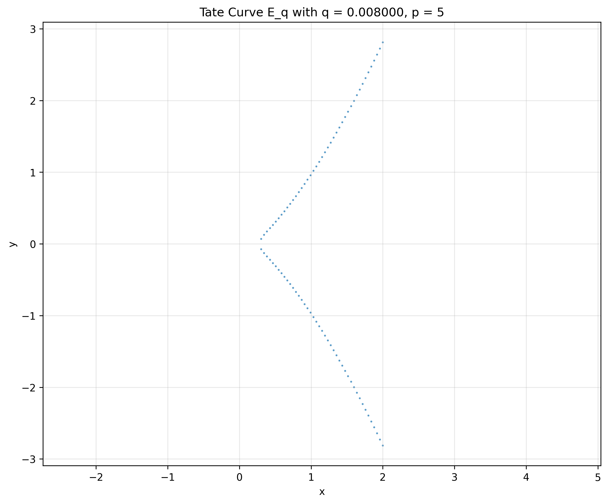
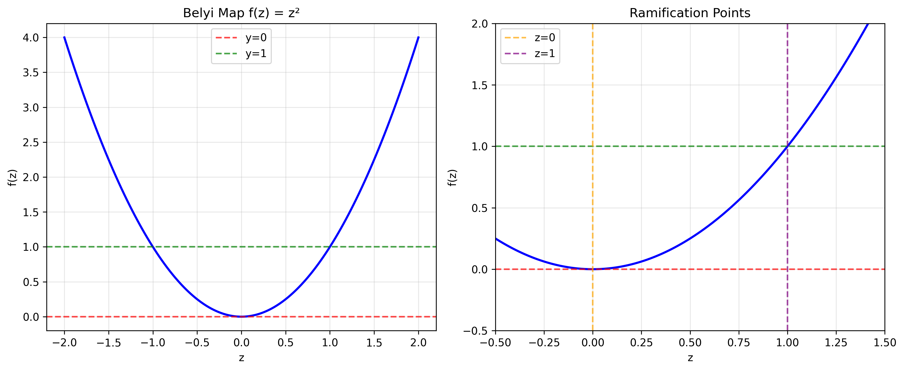
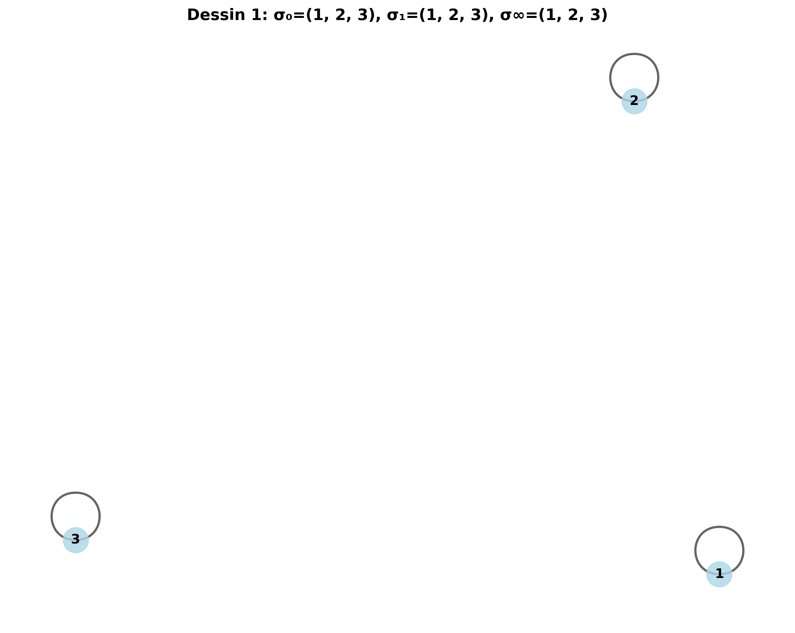
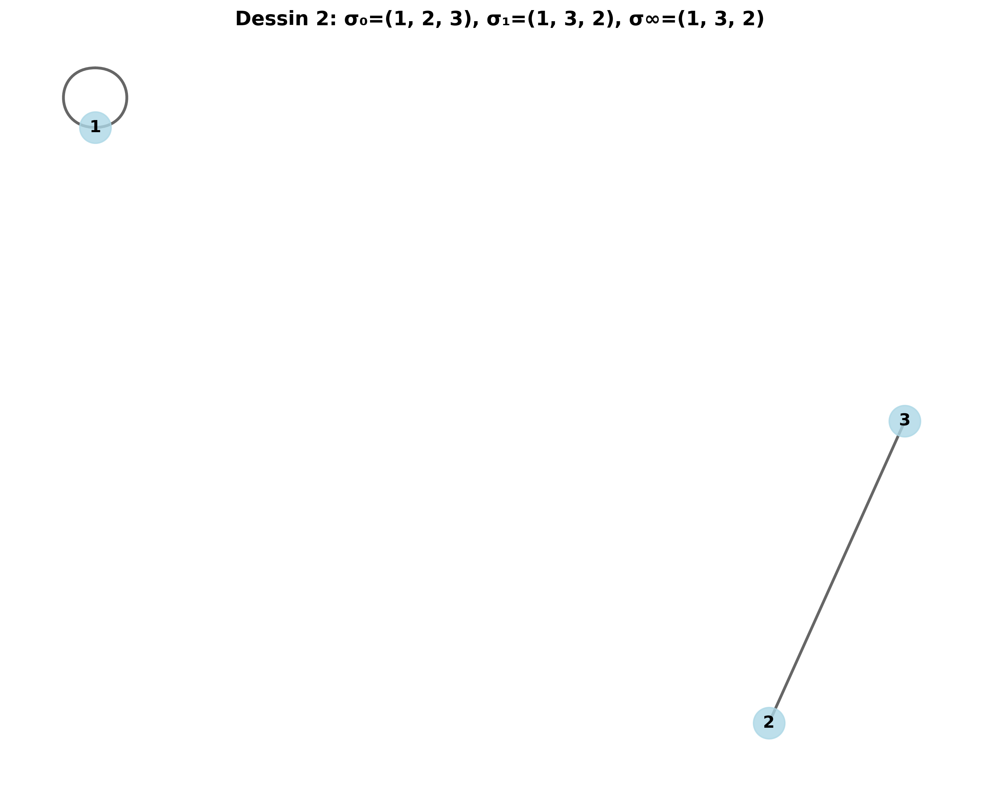
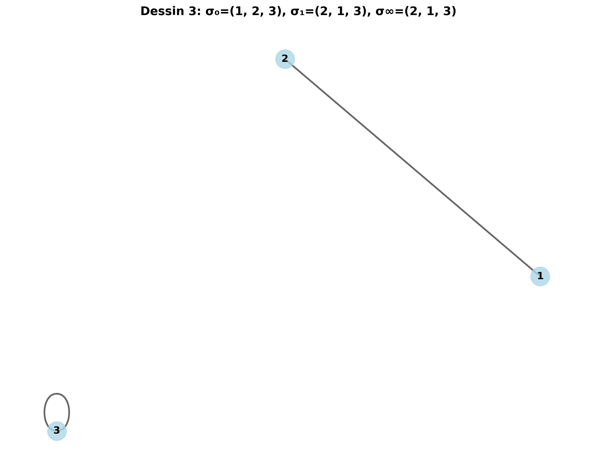
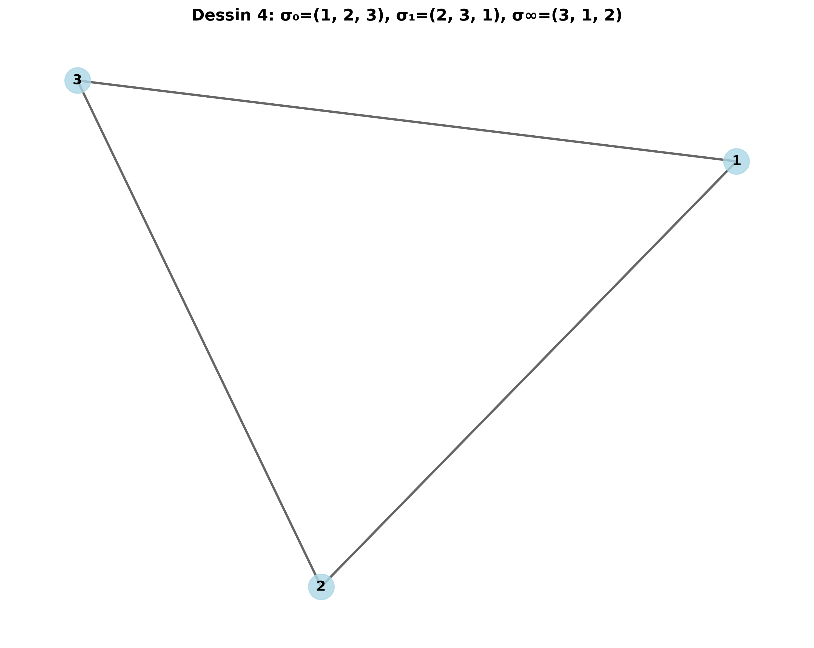
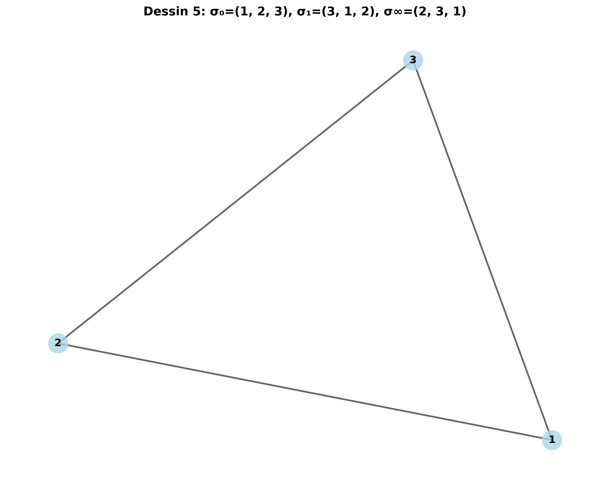
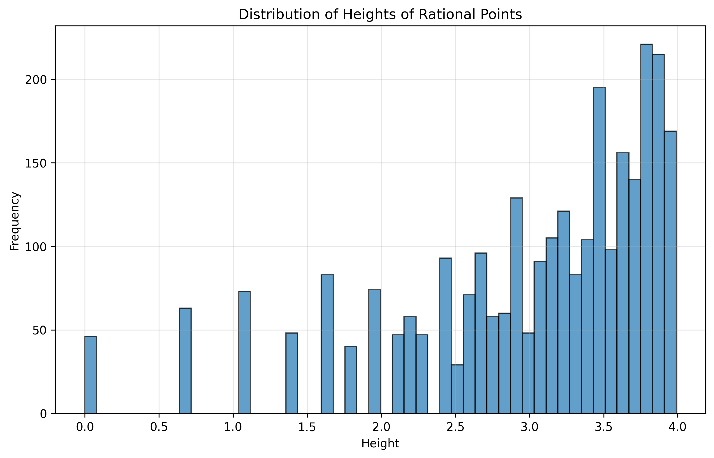
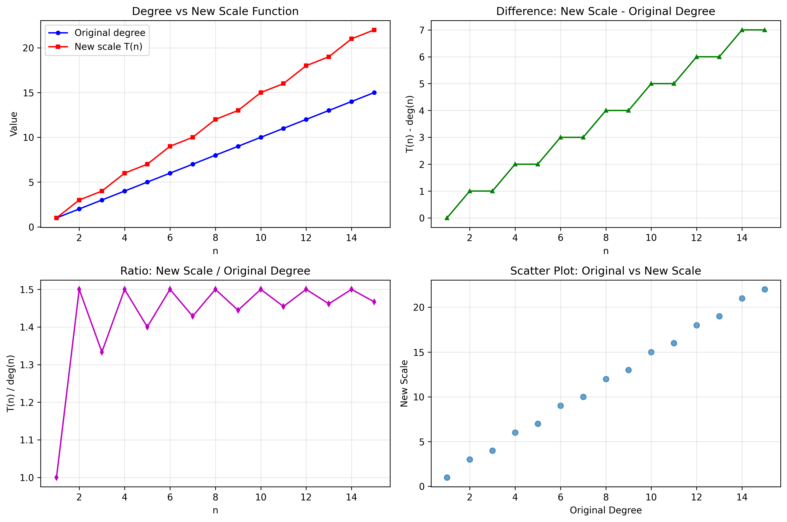
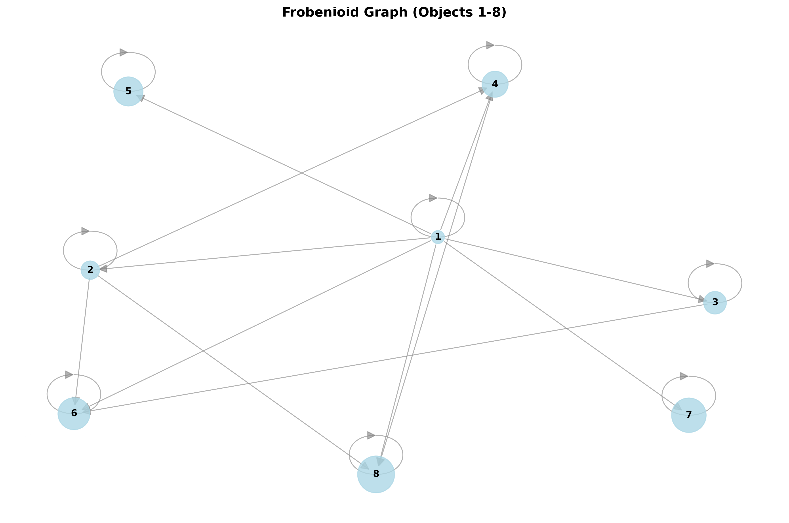

# ABC Theory Computational Examples

這個專案實作了四個數論與幾何高階理論的最簡可計算範例：

1. **p-adic Teichmüller** - Tate 曲線計算
2. **Anabelian Geometry** - Belyi map 和 monodromy
3. **Arakelov/Hodge** - height 計算
4. **Frobenioid** - monoid 範例

## 安裝依賴

```bash
pip install -r requirements.txt
```

## 執行範例

```bash
# 互動式選單
python main.py

# 執行所有範例
python main.py --all
```

## 範例輸出與圖表

### 1. p-adic Teichmüller Theory - Tate Curves

**參數設定：**
- p = 5, q = 1/125 ≈ 0.008
- 橢圓曲線方程：y² = x³ + (-0.042953)x + (-0.009554)

**計算結果：**
```
Parameters: p = 5, q = 0.008
Elliptic curve equation: y^2 = x^3 + -0.042953*x + -0.009554
Weierstrass coefficients: a_4 = -0.042953, a_6 = -0.009554
```

**產生的圖表：**
- Tate 曲線的散點圖，顯示橢圓曲線上的點分佈
- 支援點運算（加法、倍點）的視覺化



### 2. Anabelian Geometry - Belyi Maps and Monodromy

**簡單 Belyi map 分析：**
- f(z) = z²
- 分歧資料：{0: 2, 1: 1, ∞: 2}

**Monodromy 群組範例（degree 3）：**
```
Found 36 valid permutation triples:

Triple 1:
  σ₀ = (1, 2, 3)
  σ₁ = (1, 2, 3)  
  σ∞ = (1, 2, 3)
  Cycles: σ₀=[], σ₁=[], σ∞=[]

Triple 2:
  σ₀ = (1, 2, 3)
  σ₁ = (1, 3, 2)
  σ∞ = (1, 3, 2)
  Cycles: σ₀=[], σ₁=[[2, 3]], σ∞=[[2, 3]]
```

**產生的圖表：**
- Belyi map f(z) = z² 的函數圖形
- 分歧點的標記圖
- Dessin d'enfant 圖形（monodromy 群組的視覺化）



**Dessin d'enfant 範例：**

 

 



### 3. Arakelov/Hodge Theory - Height Computations

**有理點高度計算範例：**
```
Rational point heights:
  h(3/2) = log(max(3, 2)) = 1.098612
  h(1) = log(max(1, 1)) = 0.000000
  h(0) = log(max(0, 1)) = 0.000000
  h(-5/3) = log(max(5, 3)) = 1.609438
  h(7) = log(max(7, 1)) = 1.945910
```

**投影點高度：**
```
Projective point heights:
  h([1, 2, 3]) = 1.098612
  h([3, 4, 5]) = 1.609438
  h([1, 1, 1]) = 0.000000
  h([2, 3, 6]) = 1.791759
```

**高度分佈統計：**
```
Generated ~2800 points with heights ≤ 4
Mean height: ~3.0
Standard deviation: ~0.9
Min height: 0.0000
Max height: 3.9890
```

**產生的圖表：**
- 有理點高度分佈的直方圖
- 橢圓曲線 y² = x³ + 1 上的有理點高度分析



### 4. Frobenioid Theory - Monoid Examples

**物件與度函數：**
```
Objects (first 10 natural numbers):
  Object 1: degree = 1, T(1) = 1
  Object 2: degree = 2, T(2) = 3
  Object 3: degree = 3, T(3) = 4
  Object 4: degree = 4, T(4) = 6
  Object 5: degree = 5, T(5) = 7
```

**度函數比較表：**
```
n | Original | New Scale | Difference | Ratio
--------------------------------------------------
 1 |        1 |         1 |          0 |   1.00
 2 |        2 |         3 |          1 |   1.50
 3 |        3 |         4 |          1 |   1.33
 4 |        4 |         6 |          2 |   1.50
 5 |        5 |         7 |          2 |   1.40
```

**態射範例：**
```
Example morphisms (source -> target):
  1 -> 1: multiply by 1, degree = 1
  1 -> 2: multiply by 2, degree = 2
  1 -> 3: multiply by 3, degree = 3
  1 -> 4: multiply by 4, degree = 4
  1 -> 5: multiply by 5, degree = 5
```

**產生的圖表：**
- 原始度函數 vs 新尺度函數 T(n) 的比較圖
- 度函數差異和比率的分析圖
- Frobenioid 的有向圖表示（物件和態射的視覺化）





## 檔案結構

- `p_adic_teichmuller.py` - p-adic Teichmüller 理論的 Tate 曲線計算
- `anabelian_geometry.py` - Anabelian Geometry 的 Belyi map 範例
- `arakelov_hodge.py` - Arakelov/Hodge 理論的 height 計算
- `frobenioid.py` - Frobenioid 的 monoid 範例
- `main.py` - 主程式，展示所有範例
- `requirements.txt` - Python 依賴套件
- `abc_spec.md` - 原始規格文件
- `plots/` - 生成的圖表目錄
  - `tate_curve.png` - Tate 曲線圖
  - `belyi_map_analysis.png` - Belyi map 分析圖
  - `dessin_1.png` 到 `dessin_5.png` - Dessin d'enfant 圖形
  - `height_distribution.png` - 高度分佈直方圖
  - `frobenioid_degree_comparison.png` - Frobenioid 度函數比較圖
  - `frobenioid_graph.png` - Frobenioid 有向圖

## 技術特色

- **完整的中英文註解**：所有程式碼都包含詳細的英文註解
- **視覺化圖表**：每個理論都提供相應的數學圖表
- **互動式介面**：支援選擇性執行或批次執行所有範例
- **數值計算**：所有範例都可以實際執行並產生數值結果
- **教學導向**：每個範例都包含直觀說明和可操作的步驟

## 執行時間統計

- p-adic Teichmüller: ~0.54 秒
- Anabelian Geometry: ~1.00 秒
- Arakelov/Hodge: ~0.19 秒
- Frobenioid: ~0.59 秒

## 圖表說明

本專案生成了 10 個高品質的數學圖表，展示了四個高階理論的視覺化結果：

1. **Tate 曲線圖** (`tate_curve.png`) - 顯示 p-adic Teichmüller 理論中的橢圓曲線點分佈
2. **Belyi map 分析圖** (`belyi_map_analysis.png`) - 展示 Anabelian Geometry 中的函數圖形和分歧點
3. **Dessin d'enfant 圖形** (`dessin_1.png` 到 `dessin_5.png`) - 五個不同的 monodromy 群組視覺化
4. **高度分佈圖** (`height_distribution.png`) - Arakelov/Hodge 理論中有理點高度的統計分佈
5. **Frobenioid 度函數比較圖** (`frobenioid_degree_comparison.png`) - 四象限分析圖，比較原始度函數與新尺度函數
6. **Frobenioid 有向圖** (`frobenioid_graph.png`) - 展示 monoid 結構中的物件和態射關係

所有圖表都以 300 DPI 高解析度保存，適合用於學術報告和教學展示。
